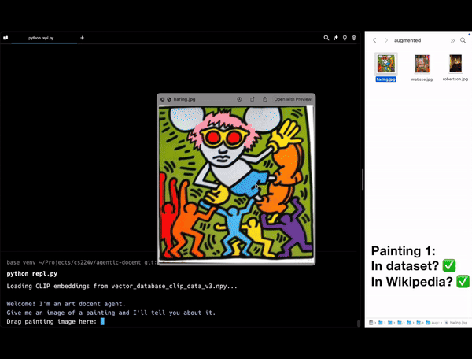

# Multimodal Agentic Art Docent
A pipeline for generating factual, informative, and engaging analyses of visual art.

## Installation
1. Clone the repository:
```bash
git clone git@github.com:ali-hindy/agentic-docent.git
```

2. Install required dependencies:
```bash
pip install -r requirements.txt
```

## Configuration
Set up your Together API key:
- Option 1: Set environment variable:
   ```bash
   export TOGETHER_API_KEY=<your_api_key>
   ```
- Option 2: Add to .env file:
   ```bash
   echo TOGETHER_API_KEY=<your_api_key> > .env
   ```
## Running Demo REPL
Note: Augmented and raw demo images are located in `./demo_images`.
1. Run repl.py script
   ```bash
   python repl.py
   ```
2. When prompted, input the path to your desired input image. Tip: dragging an image into the terminal pastes the path automatically.
   ```bash
   Drag painting image here: </path/to/image.jpg>
   ```
3. To exit the REPL, simply press return without inputting an image.

## Augmented Images
To try out the demo REPL with augmented images like those used in our testing, use the augment.py script like so:
```bash
python augment.py <input_folder> <output_folder>
```
You can then use these images as input for the REPL.

## REPL Demo GIFs


